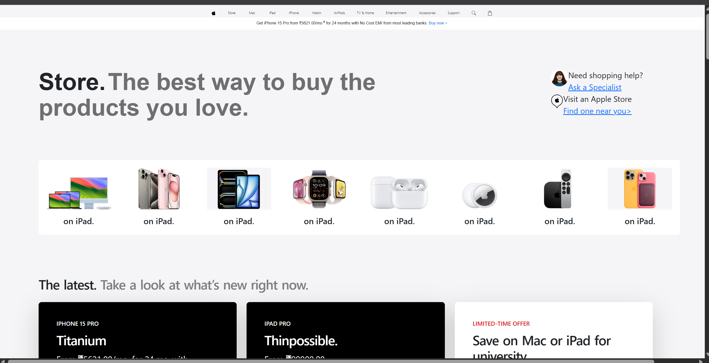
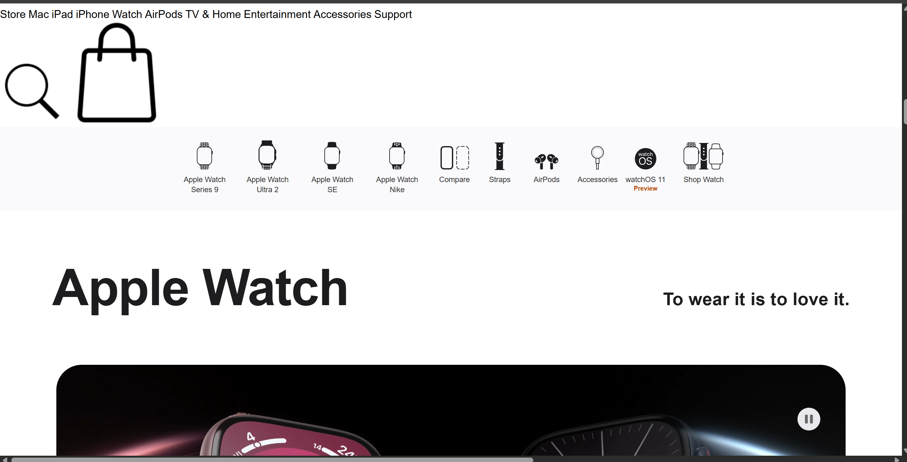
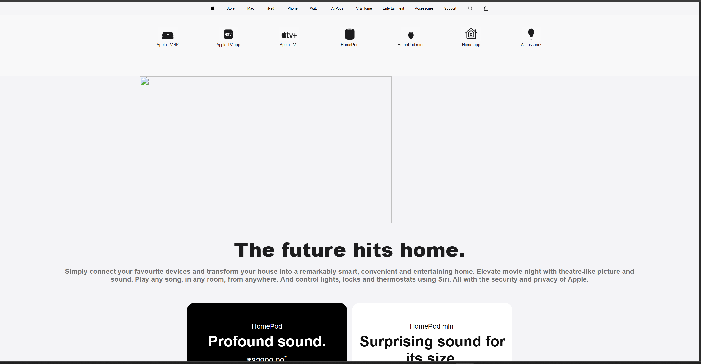
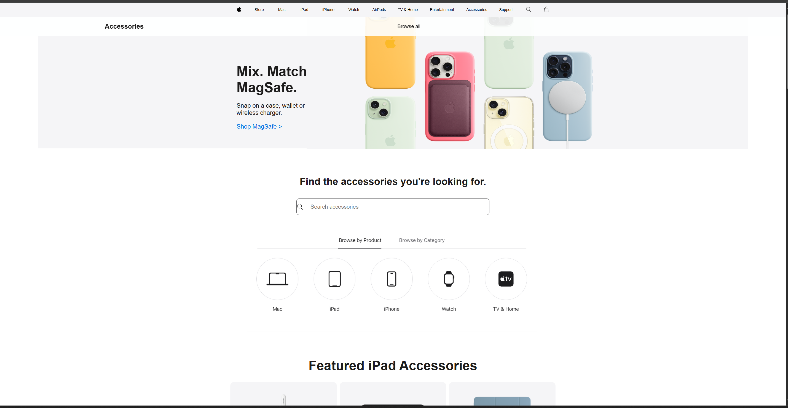

# Apple Web Workspace Mirror 🍏✨

A meticulous, multi-page frontend replication of the Apple (India) web marketplace. Built entirely with clean semantic HTML5 structures and vanilla CSS3 configurations, this responsive ecosystem clone replicates Apple's iconic design, minimalist spatial typography, structural product grids, and complex data footers.

---

## 🎨 Interactive Project Canvas

The system hosts an interconnected group of localized navigation routes mirroring actual product paths on the authentic site:

* **Home Dashboard (`Home.html`):** Renders primary cinematic hero slides targeting dynamic core software banners, seasonal university promotion alerts, and real-time maximum retail price configurations.
* **Store Platform (`Store.html`):** Implements fluid layout modules built on Bootstrap grids to showcase customized peripheral items (like the Apple Pencil Pro or Magic Keyboard) alongside direct chat helper templates.
* **AirPods Terminal (`Airpods.html`):** Embeds media assets (`video` background blocks) and heavy product presentation grids mapping generation tiers dynamically.
* **TV & Home Sandbox (`TVHome.html`):** Configures specialized audio columns, pricing markers (₹10,900.00 to ₹32,900.00), and custom nested product rows.
* **Accessories Sandbox (`Accessories.html`):** Combines left-aligned promotional banners with standard search-input backgrounds and target categorization grids.
* **Support Engine (`Support.html`):** Integrates quick-access utility grids (Forgotten Apple ID Password, Apple Repair, Billing) and comprehensive AC Wall Plug/Battery recall information program maps.

---

## 📺 User Interface & Layout Flow

Explore the visual design implementation across the operational pages of the marketplace mirror:

### 🏠 1. Home Dashboard
The entry interface replicating Apple's iconic layout hierarchy, featuring minimalist text arrangements and clean hero asset rows.


### ⌚ 2. Watches Section
A clean grid layout dedicated to the Apple Watch ecosystem, emphasizing physical case aesthetics, custom straps, and technical tracking displays.


### 🎧 3. AirPods Audio Tier
An immersive, multimedia-driven canvas handling dynamic multi-generation specifications and call-to-action triggers.


### 📺 4. TV & Home Dashboard
A clean workspace layout grouping home theater items, precise regional pricing tables, and content ecosystem sliders.


### 🔌 5. Accessories Marketplace
A targeted structural dashboard splitting MagSafe configurations and peripheral quick-search inputs symmetrically.


### 🛠️ 6. Official Customer Support
An informative service index organizing core recovery grids alongside global help parameters and consumer notification lists.


---

## 🛠️ Tech Stack & Structural Engineering

* **Structural Language:** HTML5 (Semantic section wrapping, accessibility image descriptors, and raw icon vector mapping).
* **Styling Framework:** Vanilla CSS3 (Custom `SF Pro Display` system typography matching, absolute-to-relative scaling, transform transitions, and flexible sizing charts).
* **Grid Layout Extensions:** Bootstrap v5.3 (Leveraged on specialized store layout paths for reliable column partitioning).

---

## 📂 Repository File System

```text
├── Home.html                  # Apple Main Dashboard Engine
├── Store.html                 # Bootstrap-based Storefront Catalog
├── Airpods.html               # AirPods Multi-Generation Grid Canvas
├── TVHome.html                # HomePod and Streaming Interface Layout
├── Accessories.html           # Peripheral Grid and Interactive Search Panel
├── Support.html               # Official Help Center and Service Program Map
├── ThankYou.html              # Fallback Screen for Unoperative Paths
├── Home.css                   # Master Stylesheet (Navbar, Footers, Page Blocks)
├── Airpods.css                # Specialized Audio Video Rendering Adjustments
├── appeareance-img-1          # Home Interface Reference Image
├── appeareance-img-2          # Watches Interface Reference Image
├── appeareance-img-3          # AirPods Interface Reference Image
├── appeareance-img-4          # TV & Home Reference Image
├── appeareance-img-5          # Accessories Reference Image
└── appeareance-img-6          # Support Reference Image